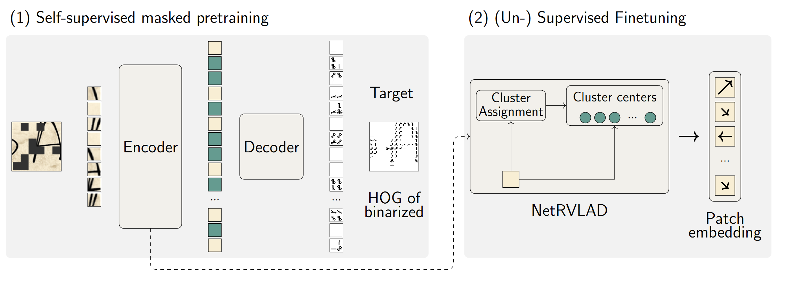

This repository contains the code implementation of our paper 

Marco Peer, Florian Kleber and Robert Sablatnig : **SAGHOG: Self-Supervised Autoencoder for Generating HOG Features for Writer Retrieval**,

a two stage approach using a masked autoencoder predicting the HOG features. We finetune our network by appending NetRVLAD, currently under review at ICDAR2024. SAGHOG works exceptionally well for large, complex datasets with small amounts of handwriting such as HisFrag20, where we outperform SOTA by ~12% mAP. 

The code hasn't been completely cleaned up yet, but should be enough to either reuse parts of it (model, training code, etc.) or take a closer look for your own work or reviewing.

## Installation

Install the packages via

    pip install -r requirements.txt

The repository uses wandb for logging.

## Patch extraction

We provide four scripts (two with a color version each for RGB images) to extract the patches from the documents:

- `utils/extract_patches_only.py` : only extracts patches without clustering (mainly used for test sets)
- `utils/extract_patches.py` : extracts patches and clusters their descriptors (mainly used to train sets)

The respective configs for the scripts to reproduce our results are located in the `config` directory.

## Defining your own dataset

in `datasets_example/create_dataset_csvs.py`, create a class, e.g.
```python
    class HisFrag20_Train_Cluster(CSVWriter):
        name = 'hisfrag20_train_patches_clustered'
        labels = {
            'cluster' : '(\d+)',
            'writer' : '\d+_(\d+)',
            'page' : '\d+_\d+_(\d+)',
            'fragment' : '\d+_\d+_\d+_(\d+)'
        }
        root = '/data/mpeer/resources/hisfrag20_train_clusters'
        mode = 'color'
        out = 'datasets/' + name + '.csv'
```

where `root` is the directory containing the images (e.g. the patches) and `labels` describes all relevant regular expressions to extract writer/page/fragment labels etc. This will create a csv for the `config.yml`, see examples in `datasets_example`. (For testing - aggregation to calculate the descriptors - `writer` and `page` are mandatory, training label, e.g. Supervised or CL-S, can be set in the config).

## Pretraining

```python
    python main_maskfeat.py --config=CONFIG_FILE.yml --gpuid=GPUID
```

## Finetuning

```python
    python main_finetune.py --config=CONFIG_FILE.yml --gpuid=GPUID
```

## Models and dataset

I currently do not intend to publish the final dataset (the 24k documents preprocessed with SAM) for pretraining since you can generate it with the scripts in `preprocess`, the original datasets are available at the webpages of the corresponding competitions. 

I will upload pretrained model checkpoints soon. However, if you need them sooner or you want the dataset, just drop me a mail - mpeer@cvl.tuwien.ac.at - and I am happy to send it to you.

## Questions

If you have questions, feel free to contact me. The paper will be also publicly available if accepted at ICDAR, otherwise I will upload it to arxiv!
